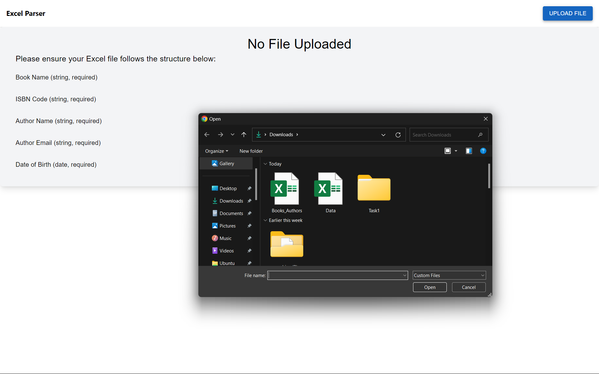
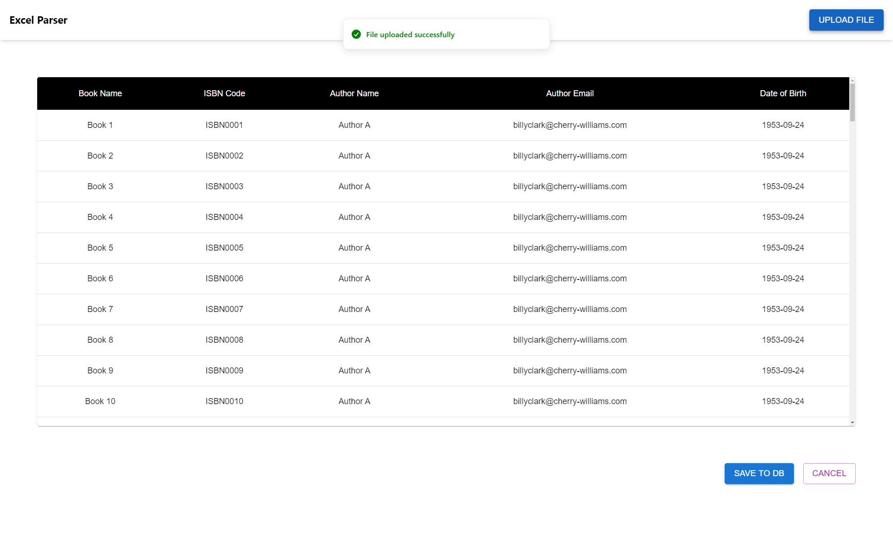
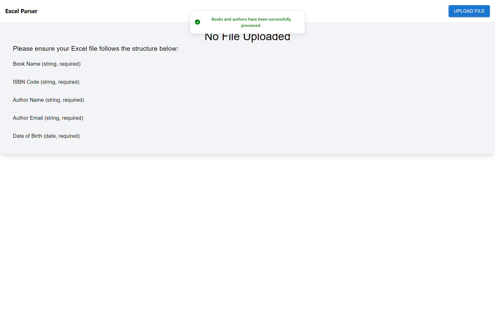

# Task 1 : Excel Parser

## Overview

This project is a full-stack web application with a Node.js and Express backend and a React frontend. The backend is located in the `backend` folder, and the frontend is in the `frontend` folder.

## Prerequisites

Before running the project, ensure that you have the following installed:

- Node.js (v18.16.0 or later)
- npm (Node Package Manager)

## Getting Started

### 1. Clone the Repository

```bash
git clone https://github.com/nirmalshah20519/shipmnts-task
cd shipmnts-task
```

### 2. Install Dependencies

#### Backend
Navigate to the `backend` directory and install the required Node.js dependencies.

```bash
cd backend
npm install
nodemon server.js
```

#### Frontend
Navigate to the `backend` directory and install the required Node.js dependencies.

```bash
cd frontend
npm install
npm start
```
## Screenshots

### Home Page


### On Upload


### After Uploading


### On success



### Screen Recording video of the working app is available in images directory.

<video width="320" height="240" controls>
  <source src="./images/vid.mp4" type="video/mp4">
  Your browser does not support the video tag.
</video>

